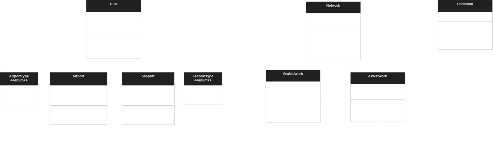

# Project Title
GmE 205 - Final Project

### Estimating demand for domestic air & sea travel via radiation modeling

# Objective

The main objective of the project is to:

> Develop a Python-based tool to estimate PH domestic air & sea travel demand using a radiation model based on distance and catchment-level relevance

Specific objectives include:
- calculate distances between hubs (airports or seaports) based on the specific characteristics of air vs. sea travel
- estimate the "relevance" of a hub based on the total population inside its catchment
- compute pairwise potential travel demand (measured as passenger flow) between hubs

# System Design

The overall object-oriented design of this project can be split into 3 main parts:

1. **Hub**: base class for nodes of inter-island transport, containing shared attributes and methods for both Airports and Seaports
    - shared attributes: hub name, lat-lon coordinates, attraction/relevance, outflow
    - methods to set a hub's attraction & outflow
    - **Airport**: extends attributes to include IATA & ICAO code + airport type
    - **Seaport**: extends attributes to include UN/LOCODE, PMO, and seaport type
2. **Network**: base class for networks of transit hubs that share a travel mode, responsible for distance calculations between hubs
    - attributes: list of hubs (either all sea or all air), nx.Graph() of links between hubs
    - methods: graph builder, 3 distance calculations
        - pairwise
        - network-wide
        - single-source (1 origin to all other destinations)
3. **Radiation**: class containing radiation modeling logic (see docstring for more information)
    - requires a network of airports & seaports
    - model simulation is kept separate from model instantiation by using a method, which requests hub attribute names for ID, outflow, and relevance
    - uses Networkx for efficient OD matrix creation

# Task List

- [x] New `Network` class to store routing/distance functionalities across a list of `Hub` objects
- [x] Child classes of `AirNetwork` and `SeaNetwork`
    - `AirNetwork`: via Haversine distance
    - `SeaNetwork`: convert pyvisgraph.VisGraph to nx.MultiGraph --> nx.multi_source_path_length
= [x] `Hub`, `Airport` and `Seaport` classes to lose `distance_to()` and related methods
    - `Hub`: `assign_attraction`, `assign_population`, `get_hub_id`, etc.
    - `Airport`:  `get_hub_id` (IATA or ICAO), `get_airport_type`
    - `Seaport`: `get_hub_id` (UN/LOCODE), `get_pmo`, `get_seaport_type`
- [x] `Radiation` to use pre-computed distance matrix from `Network` or its children + vectorized operations for its calculations
- [x] Update UML diagram to reflect new `Network` classes and revisions to `Hub` and `Radiation` classes

